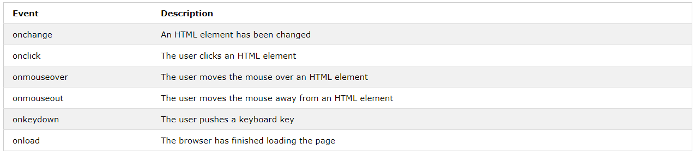

# 자바스크립트 이벤트

HTML 이벤트는 HTML 요소에 어떤일이 일어나는 것 입니다.
HTML 페이지에 자바스크립트가 사용될 때 자바스크립트는 이 이벤트에 반응합니다.

## HTML 이벤트

HTML 이벤트는 브라우저가 또는 유저가하는 무언가 입니다.

여기에 HTML 이벤트의 예제가 있습니다.
* HTML 웹 페이지는 로딩이 끝났습니다.
* HTML 입력 필드는 바뀌었습니다.
* HTML 버튼은 클릭되었습니다.

이벤트가 일어날 때 아마도 무언가를 하길 원할겁니다.
자바스크립트는 이벤트가 감지됐을 때 코드를 실행합니다.
HTML은 HTML 요솔 이벤트 핸들러 속성을 자바스크립트코드와 함께하는 것을 허용합니다.

싱글 quotes로 :
> <_element_ _event_=**'**_**some JavaScript**_**'**>

더블 quotes로:
><_element_ _event_=**"**_**some JavaScript**_**"**>

다음 예제는 `onclick` 속성을 `<button>`에 추가합니다.

```javascript
<button onclick="document.getElementById('demo').innerHTML = Date()">The time is?</button>
```

위의 예제에서 자바스크립트 코드는  id ="demo" 요소의 내용을 바뀝니다.
다음 예제에서 코드는 자신의 요소의 내용을 바꿉니다.

```javascript
<button onclick="this.innerHTML = Date()">The time is?</button>
```

> 자바스크립트 코드는 종종 라인이 깁니다. 이벤트의 속성을 보기위해서 함수를 호출하는 것은 좀더 흔합니다.

```javascript
<button onclick="displayDate()">The time is?</button>
```

## 흔한 HTML 이벤트
보통으로 사용하는 HTML 이벤트 입니다.



## 자바스크립트가 무엇을 할 수 있을까요?

이벤트 핸들러는 사용자 입력, 사용자 액션 및 브라우저 액션을 처리하고 확인하는 데 사용할 수 있습니다.

* 페이지로드가 될 때마다 수행되어야할 사항
* 페이지가 닫혔을때 수행되어야할 사항
* 유저가 버튼을 클릭했을 때 수행되어야할 액션
* 유저가 데이터를 입력했을 때 수정되어야할 내용
* 등등...

많은 다른 메소드들은 자바스크립트를 이벤트와 함께 실행합니다.

* HTML 이벤트 속성은 직접적으로 자바스크립트 코드를 실행합니다.
* GTML 이벤트 속성은 자바스크립트 함수를 호출할 수 있습니다.
* 자신의 이벤트핸들러 함수를 HTML 요소로 할당할 수 있습니다.
* 이벤트가 보내지거나 다뤄지는것으로 부터 보호할 수 있습니다.
* 등등

참고 : [w3schools 자바스크립트 튜토리얼](https://www.w3schools.com/js/js_events.asp)
