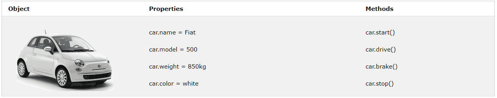

# 자바스크립트 객체

## 실생활의 객체, 속성, 그리고 메소드

실생활에서 차는 객체입니다.
차는 무게, 색깔, 그리고 출발하거나 멈추는 메소드와 같은 속성들을 가지고 있습니다.

모든 차는 같은 속성을 가지고 있습니다. 하지만 차마다 속성이 다릅니다.
모든 차는 메소드를 가지고 있습니다. 하지만 메소드는 다른시간에 수행되어집니다.

## 자바스크립트 객체
자바스크립트 변수들은 이미 데이터를 위한 컨테이너라고 배웠습니다.
이 코드는 car로 명명된 변수에 하나의 값을 할당합니다.
```javascript
var car = "Fiat";
```
객체는 역시나 변수입니다.. 그러나 객체는 많은 값들을 포함할 수 있습니다.
이 코드는 car로 명명된 변수로 다양한 값들(Fiat, 500, white)를 할당합니다.

```javascript
var car = {type:"Fiat", model:"500", color:"white"};
``` 
값은 이름:값 으로 쓰여.

## 객체 정의

객체 리터럴을 사용하여 JavaScript 객체를 정의하고 만듭니다.

```javascript
var person = {firstName:"John", lastName:"Doe", age:50, eyeColor:"blue"};
```

공백 그리고 라인 break는 중요하지 않습니다. 객체 정의는 여러 줄에 걸쳐있을 수 있습니다.

```javascript
var person = {  
firstName: "John",  
lastName: "Doe",  
age: 50,  
eyeColor: "blue"  
};
```

## 객체 속성

속성이라고 불리는 자바스크립트 객체들은 이름:값으로 쌍을 지읍니다.

## 객체 속성 들어가기

두가지의 방법으로 객체 속성으로 들어갈 수 있습니다.
>_objectName.propertyName_
> ex)   *person.lastName;*

or
> _objectName["propertyName"]_
> ex) *person["lastName"];*

## 객체 메소드
객체는 메소드를 가지고 있습니다.
메소드는 객체에서 수행하는 액션입니다.
메소드는 함수 정의로써 속성안에 저장됩니다.
```javascript
var person = {  
firstName: "John",  
lastName : "Doe",  
id : 5566,  
fullName : function() {  
return  this.firstName + " " + this.lastName;  
}  
};
```

## this 키워드
함수 정의에서 `this`는 함수의 자기자신을 뜻합니다.
위의 예제에서 `this`는 `fullName` 함수의 자기자신인 person 객체를 뜻합니다.
다른 말로, `this.firstName`은 이 객체의 `firstName`속성을 의미합니다.

## 객체 메소드 들어가기
다음의 문법으로 객체 메소드로 들어갈 수 있습니다. 

> _objectName.methodName()_
> ex) *name = person.fullName();*

`()` 괄호없이 메소드를 접근하면 함수 정의를 반환할 것입니다.

> *name = person.fullName;*

## 문자, 숫자, 그리고 Booleans형을 객체로 정의하지마세요

자바스크립트 변수가 `new`키워드로 정의될 때 변수는 객체로써 생성되어집니다.

```javascript
var x = new String(); // Declares x as a String object  
var y = new Number(); // Declares y as a Number object  
var z = new Boolean(); // Declares z as a Boolean object
```

문자, 숫자, 그리고 boolean 객체를 피하세요. 이것은 코드를 복잡하게 하고 실행 속도를 낮춥니다.

참고 : [w3schools 자바스크립트 튜토리얼](https://www.w3schools.com/js/js_objects.asp)
