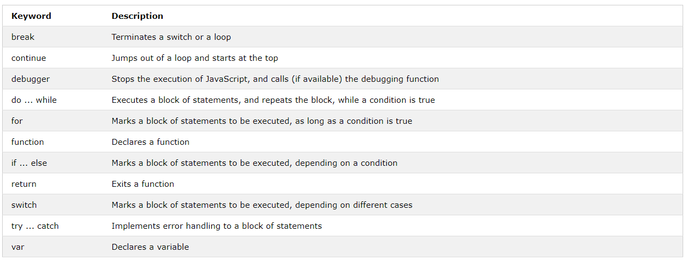

# 자바스크립트 명령문

```html
var x, y, z; // Statement 1  
x = 5; // Statement 2  
y = 6; // Statement 3  
z = x + y; // Statement 4
```

## 자바스크립트 프로그램

컴퓨터 프로그램은 컴퓨터에서 "실행"해야 할 "명령"목록입니다.
프로그래밍 언어에서 이러한 프로그래밍 명령어를 명령문이라고합니다.
자바스크립트 프로그램은 프로그래밍 명령문의 목록입니다.

> *HTML안에서 자바스크립트 프로그램들은 웹 브라우져에 의해 실행되어집니다.*

## 자바스크립트 명령문

자바스크립트 명령문은 다음과 같이 구성되어 있습니다.
 Values, Operators, Expressions, Keywords, and Comments.
 이 명령문은 브라우저에 "Hello Dolly"를 쓰라고 지시합니다. id = "demo"인 HTML 요소 내부 :
```javascript
document.getElementById("demo").innerHTML = "Hello Dolly.";
```

대다수의 자바스크립트 프로그램은 많은 자바스크립트 명령문을 포함합니다.
명령문은 작성된 순서대로 하나씩 실행됩니다.

## 세미클론;

세미클론은 자바스크립트 명령문을 분리합니다.
각각의 실행가능한 명령문의 끝에 세미클론을 추가하세요.

```javascript
var a, b, c; // Declare 3 variables  
a = 5; // Assign the value 5 to a  
b = 6; // Assign the value 6 to b  
c = a + b; // Assign the sum of a and b to c
```
세미클론에 의해서 분리될 때, 하나의 라인에서 여러가지 명령문이 수행됩니다.

```javascripy
a = 5; b = 6; c = a + b;
```

## 자바스크립트 공백
자바스크립트는 두개 이상의 공백을 무시합니다. 공백은 읽기 쉽게 만들기 위해 스크립트에 추가할 수 있습니다.
예제는 같은 명령어 입니다.

```javascript
var person = "Hege";  
var person="Hege";
```

좋은 연습은 연산자( = + - * /) 주위에 공백을 넣는 것 입니다.

```javascript 
var x = y + z;
```

## 자바스크립트 라인 길이와 라인 끊기
읽기 쉽게 하려 프로그래머들은 코드라인을 80 문자보다 더 길게 작성하는 것을 피합니다.
JavaScript 문이 한 줄에 맞지 않으면 연산자뒤에 줄을 바꾸는 것이 좋습니다.

```javascript
document.getElementById("demo").innerHTML =  
"Hello Dolly!";
```

## 자바스크립트 코드 블럭

자바스크립트 명령문은 코드블럭안에 그룹화 할 수 있습니다. 중괄호 {...}
코드 블럭의 목적은 같이 실행하기 위해 명령문을 정의하는 것입니다.
블럭으로 그룹화 된 명령문을 찾을 수있는 곳은 JavaScript 함수입니다.

```javascript
function myFunction() {  
document.getElementById("demo1").innerHTML = "Hello Dolly!";  
document.getElementById("demo2").innerHTML = "How are you?";  
}
```

## 자바스크립트 키워드

자바스크립트 명령문은 수행되어지는 자바스크립트 액션을 확인하기 위해 키워드로 시작됩니다.
여기에 이 튜토리얼에서 배울 키워드의 리스트가 있습니다.



참고 : [w3schools 자바스크립트 튜토리얼](https://www.w3schools.com/js/js_statements.asp)
