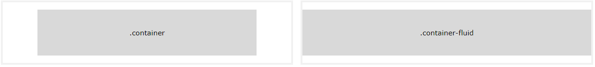

# Bootstrap 3 Tutorial

부트스트랩은 반응형, 모바일우선 웹사이트를 개발하기위한 가장 인기있는 HTML, CSS, 자바스크립트 프레임워크입니다.
부트스트랩은 다운로드하고 사용하는데 완전히 무료입니다.

## 부트스트랩 시작하기

### 부트스트랩은 무엇인가?
+ 부트스트랩은 웹 개발을 빠르고 쉽게만드는 무료 프론트엔드 프레임워크입니다.
+ 부트스트랩은 HTML과 CSS를 기반으로한 디자인 템플릿을 포함합니다.
+ 부트스트랩은 반응형 디자인을 쉽게 만들수 있는 능력을 줍니다.

```html
<div class="jumbotron text-center">  
	<h1>My First Bootstrap Page</h1>  
	<p>Resize this responsive page to see the effect!</p>  
</div>  
  
<div class="container">  
	<div class="row">  
		<div class="col-sm-4">  
			<h3>Column 1</h3>  
			<p>Lorem ipsum dolor..</p>  
		</div>  
		<div class="col-sm-4">  
			<h3>Column 2</h3>  
			<p>Lorem ipsum dolor..</p>  
		</div>  
		<div class="col-sm-4">  
			<h3>Column 3</h3>  
			<p>Lorem ipsum dolor..</p>  
		</div>  
	</div>  
</div>
```

### 부트스트랩 역사

부트스트랩은 트위터에서 Mark Otto와 Jacob Thornton에 의해 개발되었으며 깃허브에 2011년 8월에 오픈소스로써 출시되었습니다.
2014년 6월에 부트스트랩은 깃허브에서 No.1 프로젝트였습니다.

### 왜 부트스트랩은 사용하나?

부트스트랩 이점은 다음과 같습니다.
+ **사용하기 쉽습니다** : HTML과 CSS 기본적인 지식만 있으면 부트스트랩을 사용할 수 있습니다.
+ **반응형 입니다** : 부트스트랩의 반응형 CSS는 핸드폰, 태블릿, 그리고 데스트톱에도 적용합니다.
+ **모바일 우선 접근입니다** : 부트스트랩 3에서 모바일 우선 스타일은 핵심 프레임워크의 부분입니다. 
+ **브라우저 호환성입니다** : 부트스트랩은 모든 현대의 브라우저들과 호환이 됩니다.

### 부트스트랩을 어디서 얻을 수 있습니까?

자신만의 웹사이트에서 부트스트랩을 사용하는 방법은 두가지가 있습니다.

+ getbootstrap.com에서 다운로드하기
+ CDN으로 부터 부트스트랩 포함하기

### 부트스트랩은 다운로드하기

만약 스스로 부트스트랩을 다운로드하고자하면, getbootstrap.com 사이트로 들어가 지시를 따르세요

### 부트스트랩 CDN

만약 부트스트랩을 스스로 다운로드하고자하면, CDN으로부터 부트스트랩을 포함시키세요.
MaxCDN은 부트스트랩 CSS와 자바스크립트를 위한 CDN 서포트를 제공합니다. jQuery도 반드시 포함시키셔야 합니다.

MaxCDN:
```html
<!-- Latest compiled and minified CSS -->  
<link rel="stylesheet"  href="https://maxcdn.bootstrapcdn.com/bootstrap/3.4.1/css/bootstrap.min.css">  
  
<!-- jQuery library -->  
<script src="https://ajax.googleapis.com/ajax/libs/jquery/3.5.1/jquery.min.js"></script>  
  
<!-- Latest compiled JavaScript -->  
<script src="https://maxcdn.bootstrapcdn.com/bootstrap/3.4.1/js/bootstrap.min.js"></script>
```

### 부트스트랩과 첫번째 웹페이지 만들기

1. **HTML5 doctype을 추가하세요**
	부트스트랩은 HTML 요소와 HTML5 doctype을 요구하는 CSS 속성을 사용합니다.
	페이지 시작 부분에 항상 lang 속성 및 올바른 문자 세트와 함께 HTML5 doctype을 포함 시키세요.
	```html
	<!DOCTYPE html>  
	<html lang="en">  
		<head>  
			<meta charset="utf-8">  
		</head>  
	</html>
	```
2. **부트스트랩3은 모바일 우선입니다.**
	부트스트랩3은 모바일 장치에 반응형이되길 디자인 되었습니다. 모바일 우선 스타일을 핵심 프레임워크의 부분입니다. 적절한 렌더링과 터치 줌을 보장하기위해서, \<head>요소안에 \<meta>를 추가하세요.
	```html
	<meta name="viewport"  content="width=device-width, initial-scale=1">
	```
	`width=device-width` 부분은 디바이스의 와이드 스크린을 따르기 위해서 페이지의 넓이를 설정합니다.
	`initial-scale=1` 부분은 페이자가 브라우저에 의해 첫번째 로딩될 때, 최초의 줌 레벨을 설정합니다.

3. **컨테이너**
	부트스트랩은 사이트 내용을 감싸기위해 컨테이너 요소를 요구합니다.
	선택을 위한 두가지 컨테이너가 있습니다.

	1. `.container` 클래스는 반응형 고정된 와이드 컨테이너를 제공합니다.
	2. `.container-fluid` 클래스는  뷰포인트의 전체 와이드에 걸쳐 전체 와이드 컨테이너를 제공합니다.



### 두개의 기본적인 부트스트랩 페이지

다음 예제는 기본적인 부트스트랩 페이지를 위한 코드를 보여줍니다.(반응형 고정형 와이드 컨테이너)
```html
<!DOCTYPE html>  
<html lang="en">  
<head>  
	<title>Bootstrap Example</title>  
	<meta charset="utf-8">  
	<meta name="viewport"  content="width=device-width, initial-scale=1">  
	<link rel="stylesheet"  href="https://maxcdn.bootstrapcdn.com/bootstrap/3.4.1/css/bootstrap.min.css">  
	<script src="https://ajax.googleapis.com/ajax/libs/jquery/3.5.1/jquery.min.js"></script>  
	<script src="https://maxcdn.bootstrapcdn.com/bootstrap/3.4.1/js/bootstrap.min.js"></script>  
</head>  
<body>  
  
<div class="container">  
	<h1>My First Bootstrap Page</h1>  
	<p>This is some text.</p>  
</div>  
  
</body>  
</html>
```
다음 예제는 기본적인 부트스트랩 페이지를 위한 코드를 보여줍니다.(전체 와이드 컨테이너)
```html
<!DOCTYPE html>  
<html lang="en">  
<head>  
	<title>Bootstrap Example</title>  
	<meta charset="utf-8">  
	<meta name="viewport"  content="width=device-width, initial-scale=1">  
	<link rel="stylesheet"  href="https://maxcdn.bootstrapcdn.com/bootstrap/3.4.1/css/bootstrap.min.css">  
	<script src="https://ajax.googleapis.com/ajax/libs/jquery/3.5.1/jquery.min.js"></script>  
	<script src="https://maxcdn.bootstrapcdn.com/bootstrap/3.4.1/js/bootstrap.min.js"></script>  
</head>  
<body>  
  
<div class="container-fluid">  
	<h1>My First Bootstrap Page</h1>  
	<p>This is some text.</p>  
</div>  
  
</body>  
</html>
```

## 부트스트랩 그리드

### 부트스트랩 그리드 시스템
부트스트랩의 그리드 시스탬은 페이지의 12 컬럼까지 허용이 됩니다.
만약 개별적으로 12컬럼을 다 쓰지않길 원하면 와이더 컬럼을 생성하고 컬럼을 그룹화할 수 있습니다.
부트스트랩의 그리드 시스템은 반응형이고, 컬럼은 스크린 사이즈에 의존하여 자동적으로 재배열될 것 입니다.

### 그리드 클래스

부트스트랩 그리드 시스템은 4가지 클래스를 가지고 있습니다.
+ `xs`(핸드폰용 - 768px 와이드보다 작은 스크린에 적용합니다.)
+ `sm`(태블릿용 - 768px 와이드보다 크거나 같은 스크린에 적용합니다.)
+ `md`(작은랩톱용 - 992px 와이드보다 크거나 같은 스크린에 적용합니다.)
+ `lg`(랩톱 또는 데스크톱용 - 1200px 와이드보다 크거나 같은 스크린에 적용합니다.)

위의 클래스들은 좀 더 역동적이고 유연한 레이아웃을 만들기위해 혼합될 수 있습니다.

### 부트스트랩 그리드의 기본 구조

다음 예제는 부트스트랩 그리드의 기본구조입니다.
```html
<div class="row">  
	<div class="col-*-*"></div>  
	<div class="col-*-*"></div>  
</div>  
<div class="row">  
	<div class="col-*-*"></div>  
	<div class="col-*-*"></div>  
	<div class="col-*-*"></div>  
</div>  
<div class="row">  
...  
</div>
```
첫번째로, (`<div class="row">`)열을 생성합니다. 그리고 컬럼(적당한 `.col-*-*` 클래스 태그)의 요구된 수를 추가합니다. `.col-*-*`은 항상 각 열의 12개 까지 추가해야한다는 것을 주의하세요. 

아래는 기본적인 그리드 레이아웃의 몇가지 예입니다.

### 세개의 동등한 컬럼

다음 예제는 태블릿에서 시작하여 큰 데스크톱으로 확장하는 세가지의 동일한 와이드 컬럼을 만드는 방법을 보여줍니다. 768px 와이드보다 작은 모바일 폰 또는 스크린에서 컬럼은 자동적으로 쌓습니다.
```html
<div class="row">  
	<div class="col-sm-4">.col-sm-4</div>  
	<div class="col-sm-4">.col-sm-4</div>  
	<div class="col-sm-4">.col-sm-4</div>  
</div>
```

### 두개의 동등하지않은 컬럼
다음 예제는 테블릿에서 시작하여 큰 데스크톱까지 확장하는 다양한 두가지의 와이드 컬럼 만드는 방법을 보여줍니다.
```html
<div class="row">  
	<div class="col-sm-4">.col-sm-4</div>  
	<div class="col-sm-8">.col-sm-8</div>  
</div>
```

## 부트스트랩 테이블

### 부트스트랩 기본 테이블
기본 부트스트랩 테이블은 가벼운 패딩과 가로 구분선만 있습니다. 
`.table` 클래스는 테이블에 기본 스타일을 추가합니다.

### Striped Rows
`.table-striped` 클래스는 테이블에 zebra-stripes를 추가합니다.

### Bordered Table
`.table-bordered` 클래스는 테이블과 셀의 모든 사이드에 border를 추가합니다.

### Hover Rows
`.table-hover` 클래스는 테이블열에 hover effect(회색 뒷배경)를 추가합니다.

### Condensed Table
`.table-condensed` 클래스는 반으로 셀 패딩을 자름으로써 테이블을 좀더 촘촘하게 만듭니다.

### Contextual Classes
Contextual classes는 테이블 열(`<tr>`) 또는 테이블 셀(`<td>`) 색상을 지정할 수 있습니다.

contextual 클래스는 다음과 같이 사용됩니다.
+ `.active` : 테이블 열 또는 테이블 셀에 hover 색을 적용합니다.
+ `.success` : 성공적이고 긍정적인 엑션을 나타냅니다.
+ `.info` : 중립의 정보를 바꾸는 것 또는 액션을 나타냅니다.
+ `.warning` : 의도가 필요한 경고을 나타냅니다.
+ `.danger` : 위험 또는 잠재적 부정적인 액션을 나타냅니다.

### 반응형 테이블
`.table-responsive` 클래스는 반응형 테이블을 생성합니다. 그런 다음 테이블은 작은 장치(768px 미만)에서 가로로 스크롤 됩니다. 768px 와이드보다 큰 것을 볼 때 차이가 없습니다.

[w3schools 부트스트랩 튜토리얼](https://www.w3schools.com/bootstrap/default.asp)
